# ChessApp
> **NOTE:** this version of chess can only be used in order to play by two players on one device

This project is a chess app for Android being developed by KPI FICE IM-22 group student Maxim Sachko. It was created by using Kotlin.

### What can this project provide you?
<hr>

* universal board
* chess engine
* simple code for music player and timer

### Features:
<hr>

_Pause_

You can pause the game if you want to chill or to think about your move.

_Timer_

While playing, you can see timer showing the general game time.

_Music_

During the game, you can hear different music, which depends on the state of the game.

_Language changer_

During the game (or in menu), you can change app language (only English and Ukrainian for now).

### How to run it on your device?
<hr>

> **NOTE:** you need to have Android mobile device or emulator to play chess
1. install APK file from ```nothing for now```
2. transfer the APK to your phone (using a USB cable, email, cloud service, or any other method)
3. before installing a program, make sure that you have allowed the installation of programs from unknown sources
4. install APK on your phone and run it

After that, you will see the main menu of the app.

### How it looks:

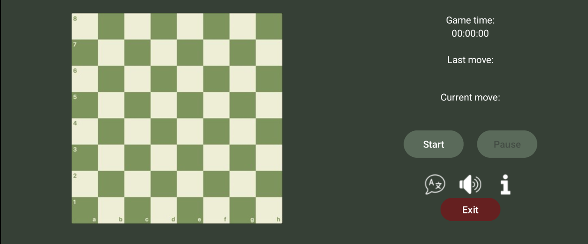
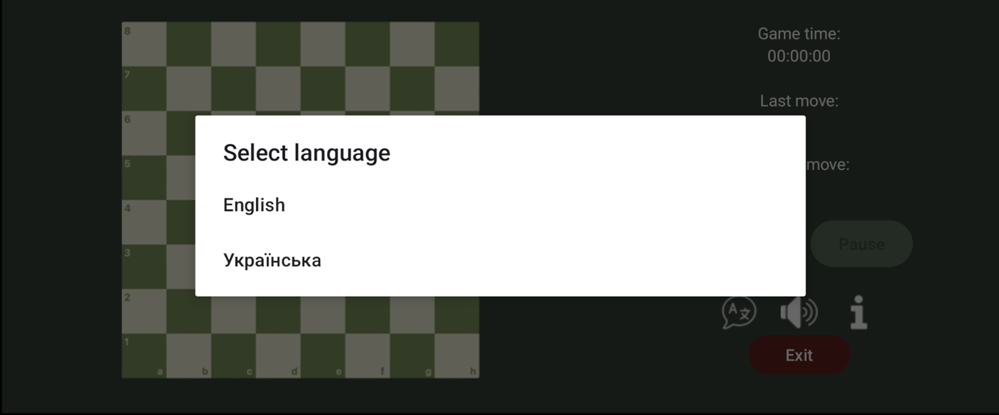
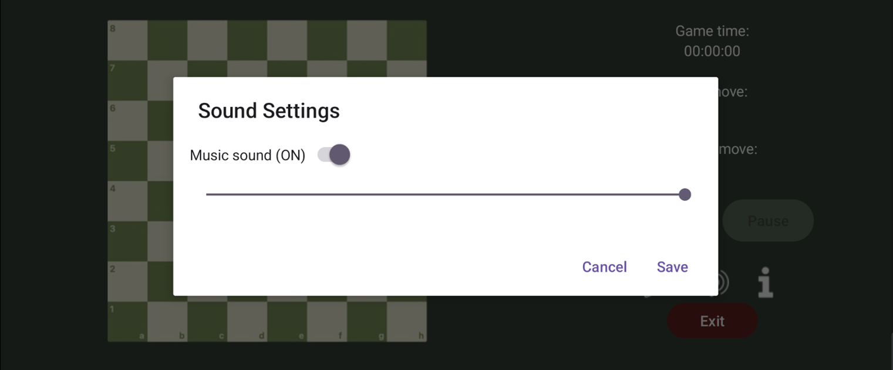
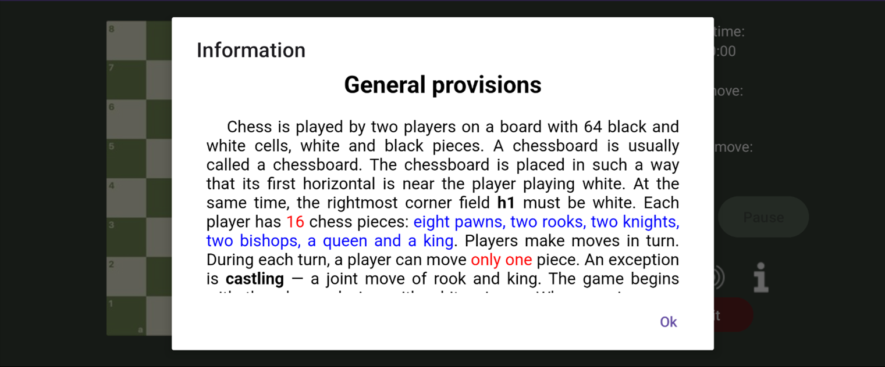
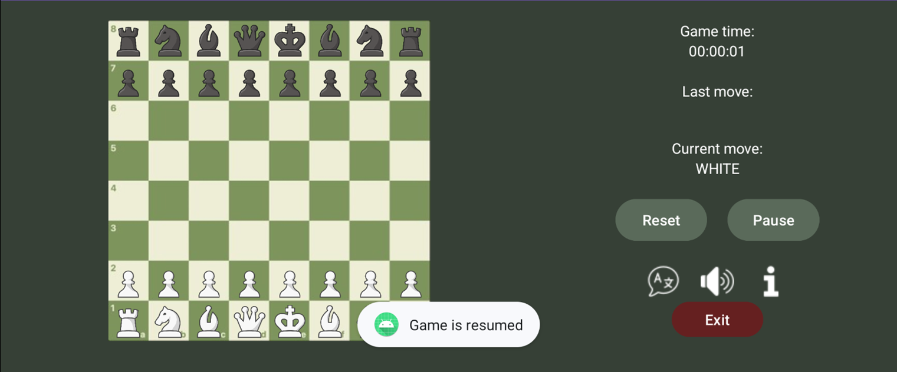
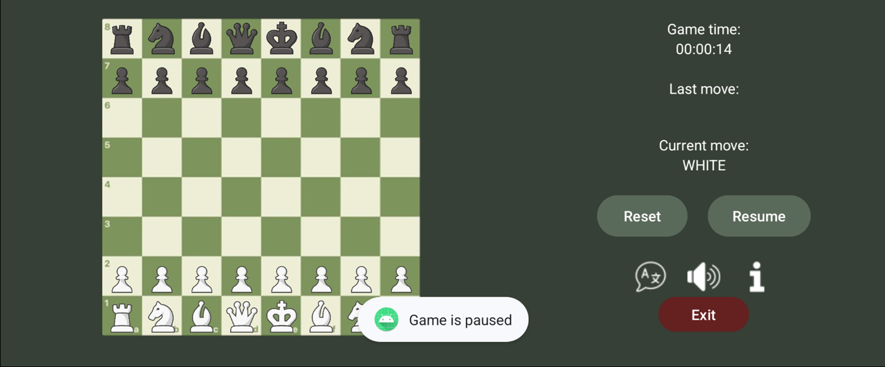
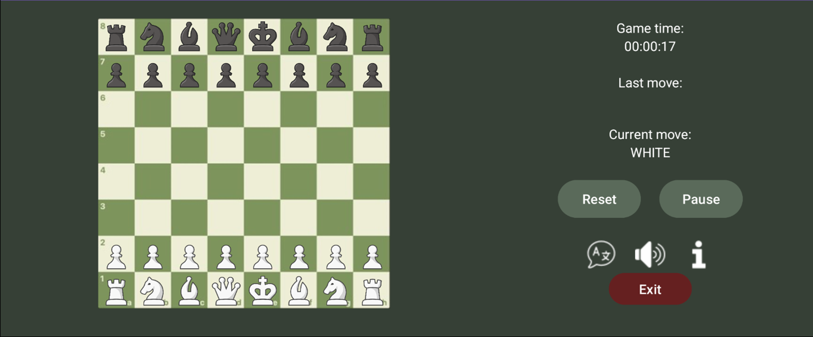
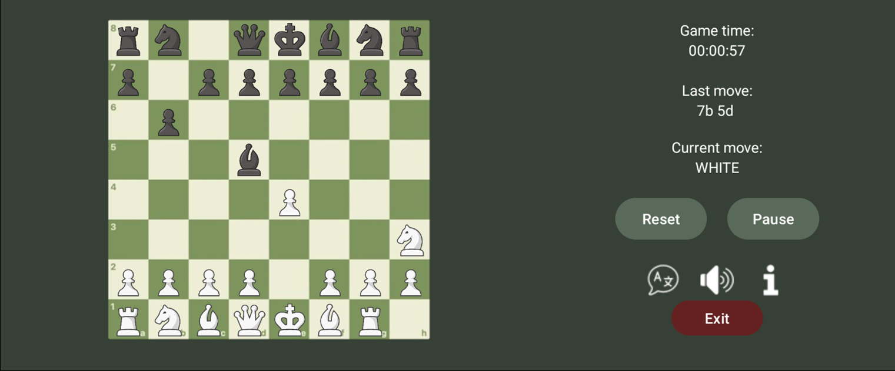
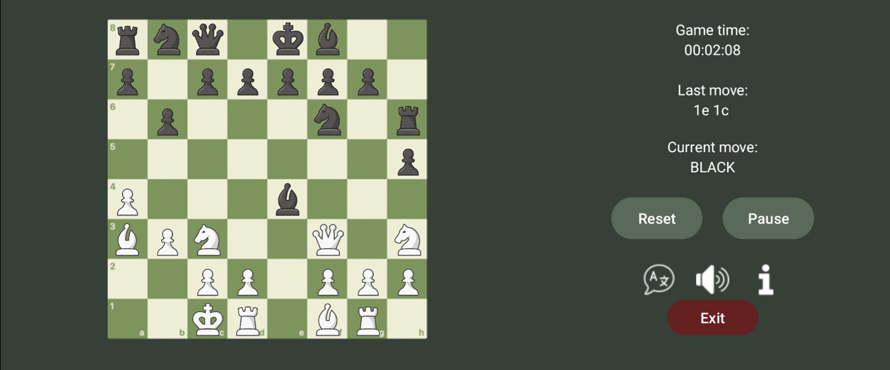
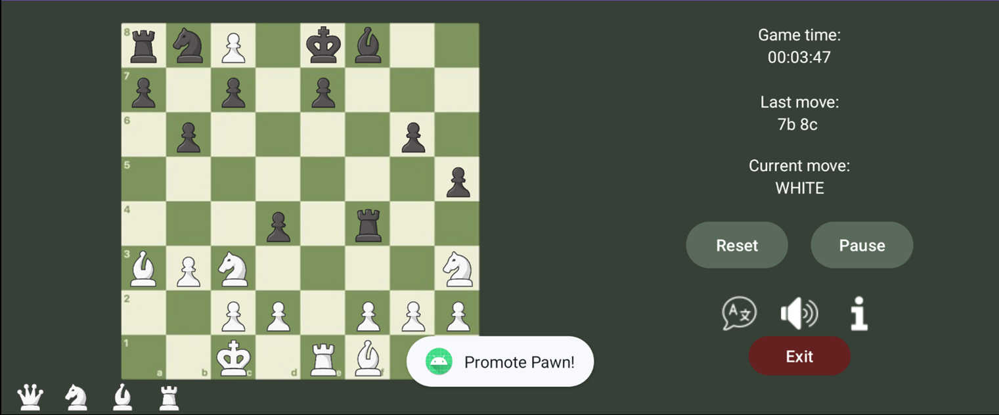
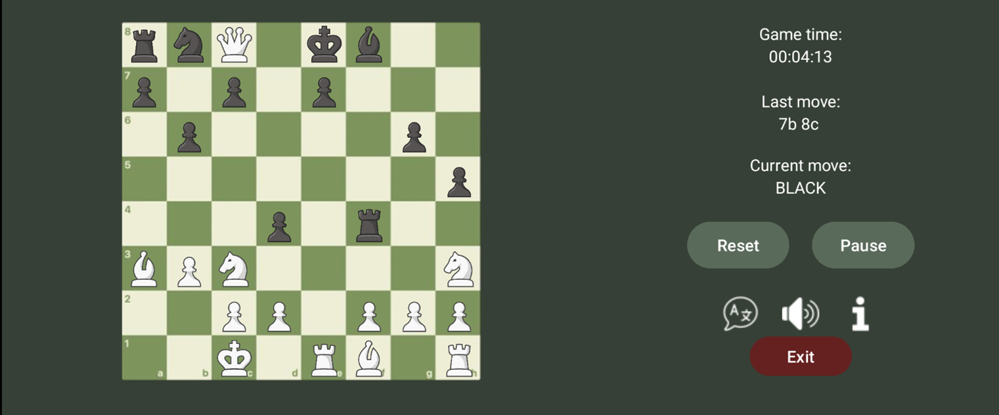
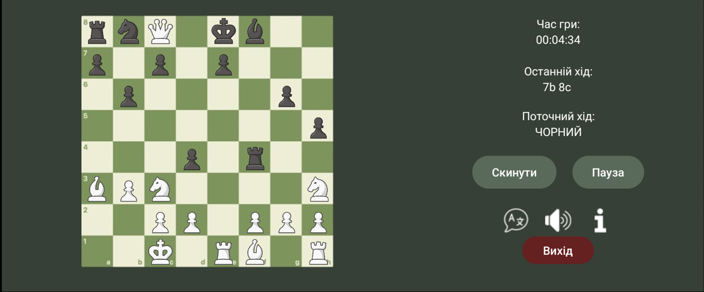
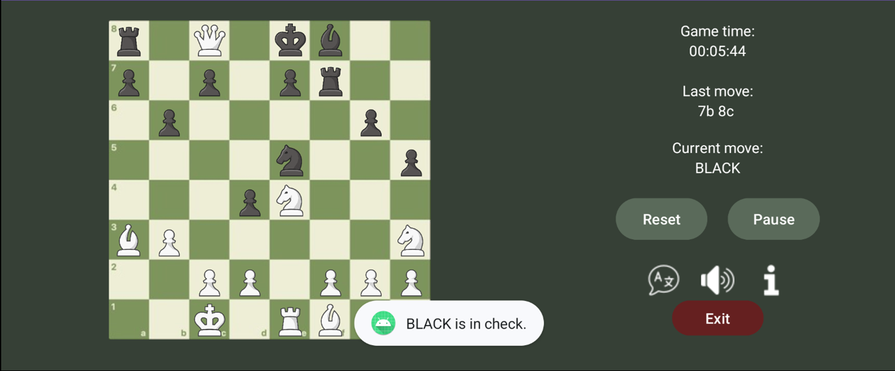
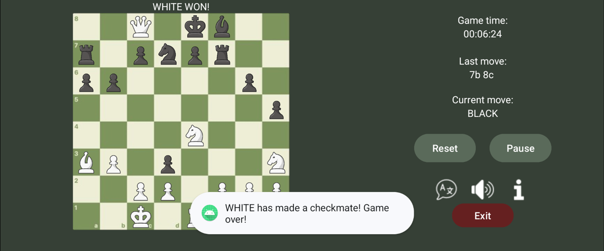

### License
<hr>

[MIT License](LICENSE)